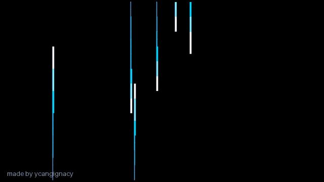

# Omarchy Screensaver for Fedora

**made by ycangignacy** · [Polski poradnik](docs/README.pl.md)

The Omarchy-style text animation, with a FEDORA wordmark, packaged as a desktop app for Fedora Workstation. It cycles through 37 effects on a black background and works offline after installation.



[Download ZIP](https://github.com/ycangignacy/omarchyscreensaverforfedora/releases/download/v1.0.1/omarchyscreensaverforfedora-v1.0.1.zip) · [See the original Omarchy screensaver](https://omarchy.org/screensaver/)

## What you get

- An app called **Fedora Screensaver** in the GNOME application menu.
- A windowed preview: press **F** for fullscreen and **Esc** to close.
- Automatic startup after **5 minutes** of inactivity, on each monitor.
- A fullscreen idle animation that closes when you move the mouse, click or press a key.
- The normal GNOME lock screen and your wallpaper when you press **Super+L**.

This animation does not lock your session. The default installer keeps your existing GNOME blanking, lock and sleep settings. Apps that inhibit inactivity, such as video players, can also pause its automatic startup.

## Install

Use Fedora Workstation with a GNOME session. Tested on **Fedora 44, GNOME 50, Wayland**, with two monitors. KDE, other compositors and Fedora Atomic desktops have not been tested.

### 1. Install the dependencies

```bash
sudo dnf install git python3-gobject gtk4 webkitgtk6.0
```

### 2. Download the project

```bash
git clone --branch v1.0.1 https://github.com/ycangignacy/omarchyscreensaverforfedora.git
cd omarchyscreensaverforfedora
```

You can also download the ZIP from the [v1.0.1 release](https://github.com/ycangignacy/omarchyscreensaverforfedora/releases/tag/v1.0.1). Extract it, then open a terminal in the extracted folder.

### 3. Install it for your user

```bash
./install.sh
```

Run this command **without sudo**, inside your GNOME desktop session. It installs a launcher and a systemd user service; you do not need to log out.

**Install once, then it starts automatically.** After restarting your computer and logging into GNOME, the animation appears after **5 minutes without keyboard or mouse activity**. You do not need to open the app or click anything. The installer enables autostart immediately, so a reboot is not required.

For the animation to replace GNOME's automatic blanking and stay visible without automatic suspend, install with:

```bash
./install.sh --replace-blanking --disable-suspend
```

This is optional and changes your desktop's idle settings. **Super+L keeps the normal lock screen with your wallpaper.**

### 4. Open it

Search for **Fedora Screensaver** in the application menu, or run:

```bash
~/.local/bin/fedora-screensaver
```

**F** toggles fullscreen. **Esc** closes the preview. The automatic idle service keeps running separately.

## Keep the animation on screen instead of GNOME blanking

This is optional:

```bash
./install.sh --replace-blanking --disable-suspend
```

`--replace-blanking` turns off GNOME's automatic blanking, dimming and lock on inactivity. **Super+L still uses the normal lock screen.**

`--disable-suspend` turns off automatic suspend on both AC and battery power. You can use either option on its own. The installer records the settings it changes and restores them when you uninstall.

## Change the idle timeout

For a 10-minute timeout:

```bash
./install.sh --idle-seconds 600
```

Or edit `~/.local/share/fedora-ascii-screensaver/config.json`. The `idle_seconds` value is read by the running service, so a restart is not needed for a timeout change.

## Turn automatic startup off or on

```bash
# Turn it off; the menu app still works.
systemctl --user disable --now fedora-ascii-screensaver.service

# Turn it back on.
systemctl --user enable --now fedora-ascii-screensaver.service
```

Install only the menu app, without enabling the idle service:

```bash
./install.sh --no-autostart
```

## Update or uninstall

From your downloaded repository:

```bash
git fetch --tags
git checkout v1.0.1
./install.sh
```

An update keeps your configured idle timeout. To uninstall:

```bash
./uninstall.sh
```

This removes the managed app, launcher and service, and restores any GNOME settings changed through the installer's optional flags. It does not remove your downloaded repository.

## Troubleshooting

Check the service and its logs:

```bash
systemctl --user status fedora-ascii-screensaver.service
journalctl --user -u fedora-ascii-screensaver.service -n 30
```

If a fullscreen animation never appears, check that the service is enabled, the session is unlocked, and GNOME's display timeout is longer than five minutes. A video player or presentation app may be preventing idle startup.

If the installer says its target folder already exists, it found an older or unrelated installation. It stops before overwriting that folder. This protects existing files; inspect the folder before moving it or switching installations.

## Development

The desktop wrapper uses Python, GTK 4 and WebKitGTK. The frontend renders frames from the bundled **ttfx WebAssembly engine**. It serves only bundled files through a loopback HTTP server, with no external requests during playback.

Run the installer tests:

```bash
GSETTINGS_BACKEND=memory python3 -m unittest discover -s tests -v
```

The GIF above is captured from the real animation. To regenerate it, install `python3-pillow` and run `python3 scripts/capture_preview.py` from a GNOME session.

## Credits and license

Desktop app, Fedora integration, installer and frontend: **made by ycangignacy**.

The animation designs come from [TerminalTextEffects by ChrisBuilds](https://github.com/ChrisBuilds/terminaltexteffects), through [ttfx by Omacom](https://github.com/omacom/ttfx). The font is [JetBrains Mono](https://github.com/JetBrains/JetBrainsMono); the ASCII letter design is Delta Corps Priest 1 by CoSMiC cHiLD.

Project code is MIT licensed. Third-party copyright notices and license texts are preserved in [NOTICE](NOTICE) and [licenses](licenses/). This is an independent project, not an official Fedora or Omarchy product.
